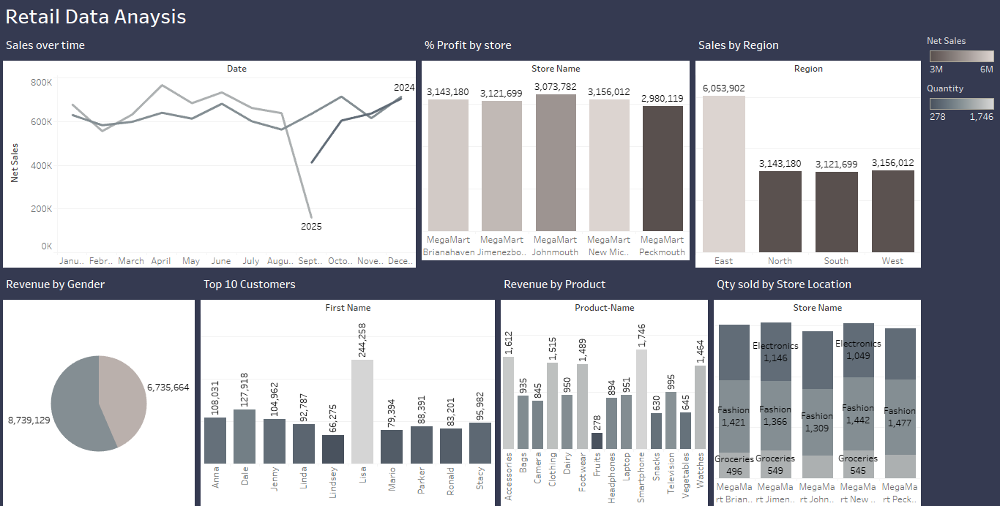

# Retail Sales Analysis – SQL + Tableau

##  Project Overview
This project analyzes retail sales data to uncover insights into customer behavior, product performance, and store revenue.  
I used SQL to clean, join, and prepare the dataset, and Tableau to build an interactive dashboard for data visualization.

The dataset contains four tables:
- **Customers** – customer demographics and join dates
- **Stores** – store details including city and region
- **Products** – product categories, unit price, and cost price
- **Transactions** – sales transactions with quantities purchased
-  **The raw dataset downloaded from Kaggle**

##  Key SQL Steps
- Performed multiple joins between `customers`, `stores`, `products`, and `transactions`
- Calculated **Net Sales** = `quantity * unitprice`
- Calculated **Profit** = `(unitprice - costprice) * quantity`
- Aggregated metrics by **region, city, product category, and customer segment**

##  Tableau Dashboard
The Tableau dashboard provides: 
- **Sales by Region and City**  
- **Top Customers by Revenue**  
- **Product Category Performance**  
- **Trend Analysis over Time**  

👉 
    -[check it out in Tableau Portfolio](https://public.tableau.com/app/profile/crystal.obidike/viz/RetailSalesAnalysis_17589221926110/Dashboard1?publish=yes)

## Tools Used
- **SQL** (joins, aggregations, profit/revenue calculations)  
- **Tableau** (interactive dashboard, KPIs, maps, trend analysis)  
- **Excel** (data source cleaning and prep)  

## Key Insights
- Top-performing regions and cities driving sales  
- Most profitable product categories  
- Identification of high-value customers  
- Clear gap between revenue and profit margins  

---
